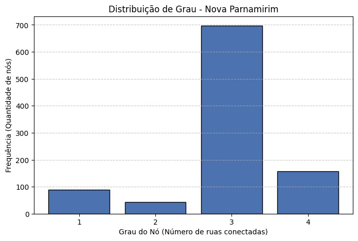
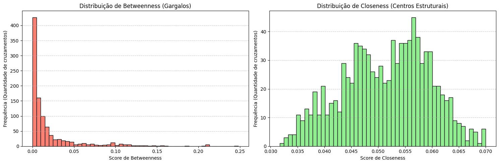
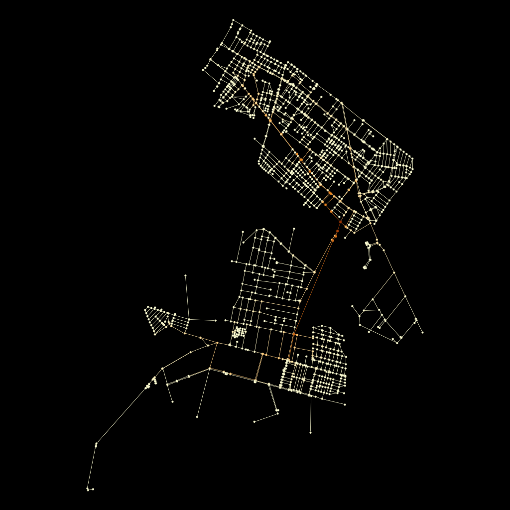
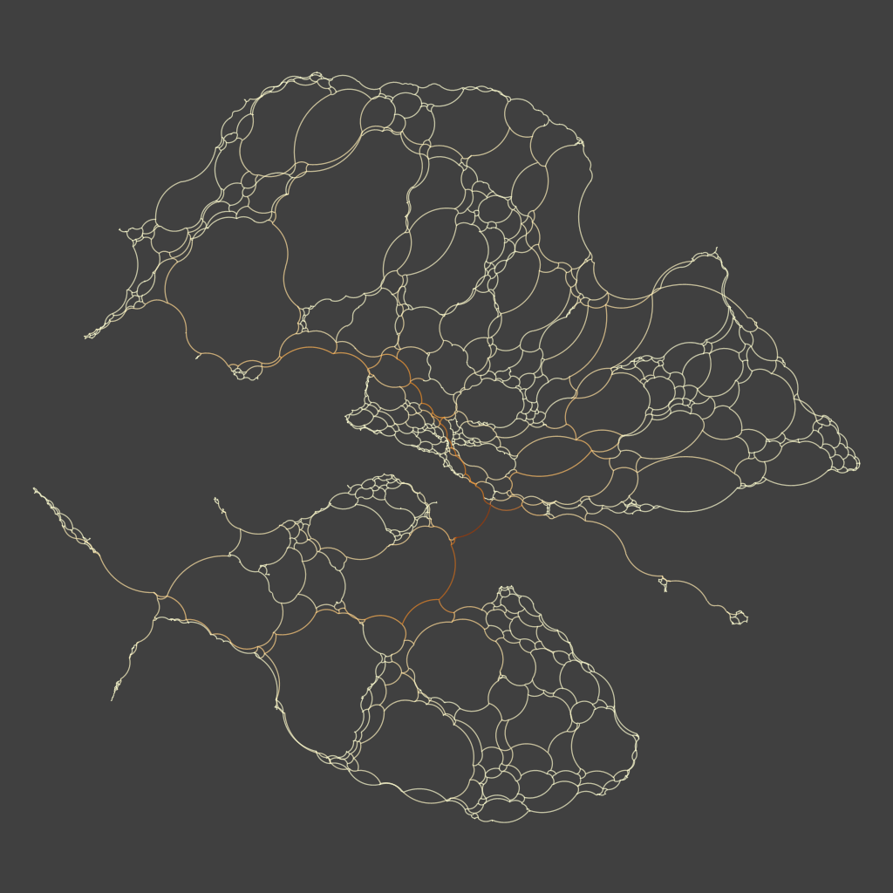
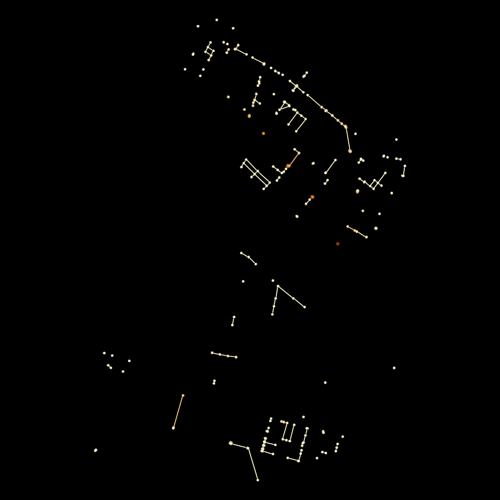
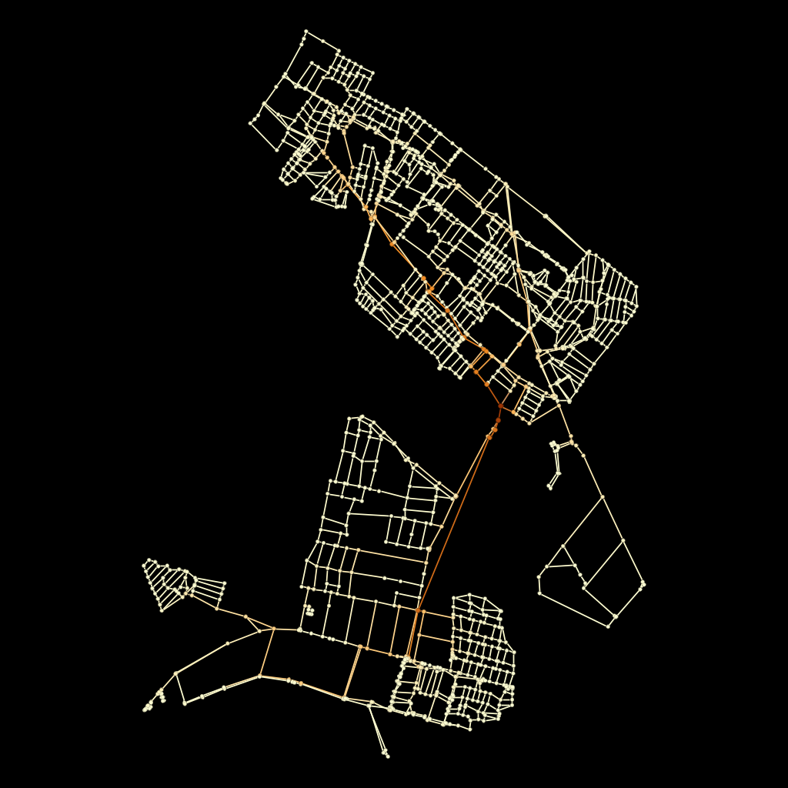

# Análise Estrutural e Topológica da Rede Urbana de Nova Parnamirim e Adjacências

Este repositório contém o projeto prático de análise de redes complexas e sistemas urbanos aplicado à malha viária, desenvolvido individualmente para a disciplina de **Estrutura de Dados II (DCA3702)** do curso de Engenharia de Computação da **Universidade Federal do Rio Grande do Norte (UFRN)**. 

O objetivo central é modelar e interpretar a infraestrutura viária de uma região urbana real utilizando a **Teoria dos Grafos**, mapeando a conectividade de cruzamentos (nós) e ruas (arestas) para identificar gargalos de tráfego, hubs de distribuição e a resiliência do sistema de mobilidade.

---

## 👥 Integrante
* **JOANDERSON LUAN DA SILVA LINHARES RODRIGUES**
* Matrícula: 20240078936
* Curso: Engenharia de Computação (UFRN)

## 🎥 Vídeo de Apresentação e Defesa Técnico-Analítica
[🔗 Clique aqui para assistir à apresentação completa no Loom](https://www.loom.com/share/seu-link-aqui-do-loom)

---

## 🧠 1. Objetivo do Trabalho
O problema norteador deste projeto consiste em responder à seguinte questão analítica:
> **Quais são os elementos estruturais mais importantes da malha viária analisada e como diferentes métricas de grafos, como grau, centralidade e k-core, ajudam a caracterizá-los?**

A proposta afasta-se do mero uso mecânico de bibliotecas de software para focar na interpretação crítica e científica dos resultados matemáticos, correlacionando a topologia computacional com o comportamento real do fluxo de veículos no espaço físico.

---

## ⚙️ 2. Região de Estudo e Justificativa Urbana
A região escolhida compreende o ecossistema urbano formado pelo bairro de **Nova Parnamirim (Parnamirim/RN)** e seus distritos limítrofes integrados: **Parque das Árvores**, **Parque do Jiqui** e **Parque das Nações**.

### Justificativa Metodológica e Empírica:
Nova Parnamirim é uma das zonas residenciais de maior densidade e crescimento acelerado na região metropolitana de Natal. Historicamente, a região expandiu-se de forma fragmentada, caracterizada pela proliferação de grandes condomínios fechados e loteamentos privados que interrompem o fluxo contínuo das vias.

Essa característica urbana cria um fenômeno crítico de mobilidade: os bairros adjacentes atuam como densas "bolhas de origem" habitacionais. Diariamente, essas regiões geram um fluxo pendular massivo de moradores que precisam atravessar a malha central para acessar os eixos de escoamento em direção à capital. Toda essa carga veicular é injetada e afunilada em pouquíssimas vias coletoras, com destaque absoluto para a **Avenida Maria Lacerda Montenegro**.

Para modelar essa dinâmica de forma fidedigna e mitigar o **Efeito de Borda** (onde a análise isolada de apenas um bairro esconderia a carga de veículos vindos de fora), a modelagem foi estruturada como uma **análise multi-bairro integrada**. Utilizando a função `graph_from_place` do OSMnx, foi possível capturar com precisão a costura topológica real de todas as vias de transição, cruzamentos comuns e conexões periféricas que sustentam o fluxo dessa macro-região.

---

## 🧪 3. Metodologia e Pipeline de Dados (Explicação do Notebook)
O projeto foi implementado em Python (Jupyter Notebook) em um fluxo modular estruturado, contendo adaptações essenciais de engenharia de dados:

1. **Ingestão de Dados Espaciais (`OSMnx`)**: Captura da geometria das ruas a partir do OpenStreetMap através da função `ox.graph_from_place`, passando a lista oficial dos bairros com o parâmetro `network_type="drive"`. O algoritmo gera um `MultiDiGraph` (Grafo direcionado com arestas paralelas).
2. **Simplificação e Limpeza Topológica (`NetworkX`)**: 
   * **Por quê?** Para garantir a precisão dos cálculos de centralidade. O grafo foi convertido em um grafo simples não-direcionado (`nx.Graph(ox.convert.to_undirected(G))`), fundindo vias de mão dupla.
   * **Remoção de Auto-loops**: Aplicou-se `G_simple.remove_edges_from(nx.selfloop_edges)` para eliminar rotatórias ou ruas em "U" que começam e terminam no mesmo cruzamento, evitando distorções no grau dos nós.
3. **Cálculo de Métricas (Otimização)**:
   * Cálculos diretos de **Grau** (`degree`), **Closeness Centrality** e **K-Core Decomposition**.
   * **Aproximação de Betweenness**: O cálculo de *Betweenness Centrality* possui alta complexidade espacial e temporal. Como escolha metodológica para não sobrecarregar o processamento, aplicou-se a aproximação `k=100` (`nx.betweenness_centrality(G_simple, k=100, normalized=True)`), garantindo a identificação confiável dos maiores gargalos por amostragem.
4. **Engenharia de Atributos para Exportação (`Gephi`)**:
   * O formato nativo do OSMnx gera conflitos de tipos no Gephi (ex: listas de velocidades múltiplas em uma única rua e bloqueio de memória dos eixos X/Y).
   * **A Solução no Código**: Iterou-se sobre todos os nós para criar colunas inteiramente novas e tipadas (`Longitude_Final` e `Latitude_Final` como *Float*), garantindo que o plugin *Geo Layout* reconhecesse as coordenadas. As métricas foram forçadas para `int` ou `float`, e todos os dados qualitativos das arestas foram convertidos para texto simples (`str`), permitindo uma exportação limpa e sem erros no arquivo `nova_parnamirim_FINAL_MESMO.graphml`.

---

## 📊 4. Apresentação das Métricas Calculadas (Estatística da Rede)

### 4.1 Perfil de Conectividade Local: Distribuição de Grau

#### 💬 Comentário Analítico da Imagem:
O gráfico de distribuição revela a natureza morfológica da malha urbana analisada. O domínio absoluto do **Grau 3** (quase 700 nós) demonstra que a rede é baseada predominantemente em entroncamentos em "T". Topologicamente, isso limita as opções de conversão imediata do motorista, forçando o tráfego a canalizar-se em rotas específicas em vez de se dispersar de forma homogênea, como ocorreria numa malha em grade perfeita (onde predominaria o Grau 4). Adicionalmente, a alta frequência de **Grau 1** reflete fisicamente as ruas sem saída e os acessos em "fundo de saco" de loteamentos, que empurram obrigatoriamente a carga veicular interna para a malha principal.

### 4.2 Distribuição de Gargalos e Centros Estruturais (Histogramas)

#### 💬 Comentário Analítico da Imagem:
Os histogramas comprovam matematicamente as vulnerabilidades do sistema de mobilidade. O gráfico à esquerda exibe a curva em "L" (cauda longa) característica do *Betweenness Centrality*: a esmagadora maioria dos cruzamentos tem score próximo de zero, servindo apenas para trânsito local. Em contrapartida, uma ínfima minoria de nós (visíveis no eixo horizontal avançando até 0.25) atua como gargalo sistêmico, suportando praticamente todo o tráfego de passagem da macro-região. Já o gráfico à direita (*Closeness Centrality*) apresenta uma distribuição que se assemelha a uma curva normal, indicando que a acessibilidade média espacial (a facilidade de chegar ao centro topológico a partir de qualquer ponto) é relativamente bem balanceada.

---

## 🗺️ 5. Visualizações Estruturais no Gephi

### 5.1 Visualização Geográfica (A Realidade Física)

#### 💬 Comentário Analítico da Imagem:
Esta visualização ancora a rede nas suas coordenadas cartográficas (GPS) utilizando o plugin *Geo Layout*. Através do mapa de calor atribuído ao *Betweenness Centrality*, a linha em tons quentes (laranja/vermelho brilhante) que corta o mapa coincide com precisão milimétrica com o eixo longitudinal da **Avenida Maria Lacerda Montenegro** e seus acessos à BR-101. Fica evidente, de forma visual, o Efeito de Borda discutido: a vasta malha de nós na parte inferior (Parque das Nações, Jiqui, Árvores) atua como um enorme funil, convergindo maciçamente a sua carga viva para este corredor central devido à total ausência de vias coletoras transversais paralelas.

### 5.2 Visualização Estrutural (A Topologia Pura via ForceAtlas2)

#### 💬 Comentário Analítico da Imagem:
Ao aplicar o algoritmo **ForceAtlas2** (com dissuasão de hubs e modo LinLog), a geografia terrestre é matematicamente anulada. O algoritmo agrupa os cruzamentos puramente pela força e densidade das suas ligações (caminhos mínimos). Como resultado, a cidade "quebra-se" visualmente em comunidades estruturais densas (*clusters* celulares) que representam os grandes condomínios e loteamentos isolados. O corredor central, antes uma avenida reta no mapa, aparece agora esticado como um tendão sob alta tensão no centro da imagem. Isso prova graficamente que ele é a **única ponte de sustentação lógica** mantendo essas bolhas residenciais conectadas ao resto do sistema.

---

## 🔍 6. Respostas Detalhadas às Questões Analíticas Obrigatórias

**1. Os nós com maior grau coincidem com os nós de maior betweenness?**
Não necessariamente. Este é um achado fundamental: cruzamentos no interior de grandes loteamentos residenciais apresentam alto grau local (Grau 4, como cruzamentos em "X" dentro de bairros). Contudo, o seu *Betweenness* aproxima-se de zero, pois atendem exclusivamente ao tráfego capilar interno (ninguém cruza a macro-região passando por eles). Em contrapartida, os nós nos eixos coletores principais apresentam scores críticos de Betweenness mesmo com graus menores (entroncamentos de Grau 3 em "T"), provando que o fluxo massivo de travessia independe da complexidade física pontual do cruzamento.

**2. O núcleo identificado pelo k-core coincide com os principais hubs?**
O algoritmo de K-Core revelou que o limite máximo de coesão desta rede é **K=2**. O fato do núcleo estabilizar nesta ordem topológica extremamente baixa denota uma coesão frágil e a ausência de uma grelha altamente redundante (que exigiria núcleos de K=3 ou K=4). Embora os principais hubs (Grau 4) pertençam a esse subgrafo K=2, eles não formam um tecido massivamente interconectado; atuam antes de forma linear ao longo das avenidas principais, flanqueados por ramificações periféricas que se quebram nas primeiras etapas da poda topológica.

**3. O que a métrica de betweenness revela que o grau não revela?**
O Grau mede a conectividade **imediata** (opções físicas na esquina). O Betweenness mede a importância **sistêmica global** (quantas rotas mínimas da macro-região inteira dependem obrigatoriamente desse nó). O Betweenness mapeia a falta de redundância estrutural: uma reta de asfalto simples pode ter Grau baixo, mas se for a única ponte asfaltada unindo duas massas urbanas, o seu Betweenness será máximo, diagnosticando-a como um ponto crítico de falha e vulnerabilidade do sistema viário.

**4. O que muda quando a rede é analisada em sua posição geográfica real e quando é analisada por um layout estrutural?**
A visão geográfica (Geo Layout) disfarça o isolamento urbano; ruas de bairros vizinhos que estão separadas por poucos metros parecem contínuas no mapa cartográfico, ignorando a ausência de interligação física (muros ou terrenos baldios). O layout estrutural (ForceAtlas2) ignora as distâncias em metros e simula a física de atração dos grafos: cruzamentos fortemente interligados colapsam em "bolhas" (clusters), revelando a verdadeira fratura do esqueleto lógico da cidade e evidenciando quais setores operam como ilhas independentes.

**5. Existem regiões críticas para mobilidade urbana na área analisada?**
Sim. O pico da cauda longa no histograma de Betweenness evidencia de forma incontestável que o longo eixo da **Avenida Maria Lacerda Montenegro** é a zona de saturação sistêmica. Topologicamente, essa criticidade é agravada por gargalos dinâmicos localizados em pontos específicos do eixo, como o fluxo gerado em horários de pico escolares no entorno do Colégio CEI. Além disso, a iminente inauguração de um novo shopping center na avenida, com aproximadamente 22.353 m² de Área Bruta Locável (ABL), introduzirá um massivo Polo Gerador de Tráfego (PGT) diretamente sobre os nós de maior intermediação do grafo. Sem rotas paralelas estruturadas, este novo volume de caminhos mínimos forçados sobre a mesma artéria predispõe o sistema a um cenário de colapso de vazão e saturação física irreversível.

**6. A rede parece homogênea ou apresenta concentração estrutural?**
A rede demonstra uma **altíssima concentração estrutural e hierárquica**, operando no extremo oposto de uma malha homogênea (grelha contínua). A predominância absoluta do Grau 3 combinada com a alta incidência do Grau 1 impõe uma topologia em formato de árvore: as ruas residenciais afunilam o fluxo obrigatoriamente para os eixos secundários que, por sua vez, descarregam massivamente a carga sem alternativas para a única via coletora primária da região.

**7. Os resultados obtidos fazem sentido considerando o conhecimento urbano da região escolhida?**
Absolutamente. O modelo computacional traduz para a matemática a causa raiz dos congestionamentos históricos vividos diariamente pela população local, visíveis sobretudo nos gargalos de início e fim de expediente e nos horários de entrada e saída escolares. O planejamento da expansão urbana focou no isolamento territorial de loteamentos privados, destruindo a capilaridade transversal (fato comprovado matematicamente pelo core de K=2). Diante dessa incapacidade de vazão, os debates locais de planejamento urbano convergem exatamente para propostas estruturais drásticas, como a transformação da Avenida Maria Lacerda Montenegro em sentido único, compondo um **sistema viário binário** com a vizinha Avenida Ayrton Senna ou Abel Cabral operando no sentido inverso. Na Teoria dos Grafos, isso equivale a alterar a capacidade e a direção das arestas para mitigar o Betweenness acumulado, validando totalmente a aplicação do modelo computacional à realidade factual da engenharia de tráfego local.

---

## 🚀 7. Filtros Aplicados no Gephi para Análise Avançada

Para extrair conclusões estruturais profundas e remover o ruído visual de centenas de vias estritamente locais, aplicamos dois filtros de topologia obrigatórios na interface do Gephi. Abaixo apresentamos os resultados visuais dessas filtragens.

### 7.1 Filtro de Top 10% por Grau (Os Grandes Hubs)

#### 💬 Comentário Analítico da Imagem:
Na nossa análise estatística em Python, identificamos que a rede atinge o seu teto máximo de conectividade pontual com o Grau 4. Portanto, isolar os $\sim$ 10% superiores consistiu em filtrar estritamente a consulta (`Degree Range: 4 - 4`). O resultado visual acima expõe o desaparecimento da massa residencial esmagadora. O que sobrevive no mapa escuro é a "espinha dorsal" pontual da região: os maiores entroncamentos, rotatórias e cruzamentos arteriais. Note como estes pontos-chave são escassos, alinhando-se ao longo das rotas de fuga principais, provando a baixa disponibilidade de vias de alta capacidade cruzada no sistema.

### 7.2 Filtro de Subgrafo K-Core (Núcleo Denso K $\ge$ 2)

#### 💬 Comentário Analítico da Imagem:
O algoritmo calculou a fragilidade coesa da malha estabelecendo o núcleo máximo em $K=2$. Ao aplicar a consulta topológica (`core_number range: 2 - 2`), o filtro atua como uma tesoura que poda todas as extremidades estruturais débeis da cidade (acessos em fundo de saco e dead-ends). O "esqueleto viário" resultante na imagem desvenda o genuíno circuito fechado e navegável da macro-região. Fica evidente a alarmante magreza e linearidade da rede quando desprovida dos acessos capilares: existem ínfimas alternativas contínuas para o trânsito fluir sem interrupções.

---

## 🎯 8. Principais Conclusões
* A Teoria dos Grafos, suportada por ferramentas como OSMnx e Gephi, atua como uma lente científica poderosa, convertendo percepções e sofrimentos urbanos diários (congestionamentos) em anomalias métricas rastreáveis.
* A macro-região (Nova Parnamirim, Pq. das Árvores, Pq. do Jiqui e Pq. das Nações) exibe uma **resiliência topológica perigosamente baixa**, sustentada pela dependência sistêmica extrema de escassos nós de elevado Betweenness Centrality.
* Sob a ótica das Redes Complexas, soluções efetivas de engenharia de tráfego para a área não residem na ampliação unidimensional de avenidas existentes, mas sim na intervenção baseada na criação de **novas arestas (ligações interbairros contínuas)** que conectem as bolhas residenciais transversais, injetando redundância e reduzindo o esmagamento matemático do fluxo principal.

---
**Algoritmos e Estruturas de Dados II** | Engenharia de Computação | UFRN | 2026.1
